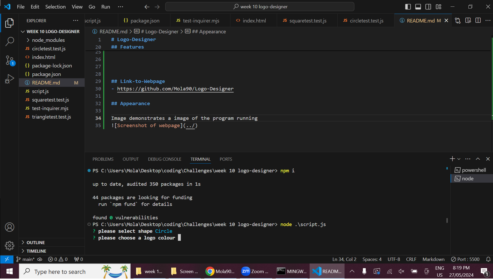

# Logo-Designer

This is a command-line application that takes user input to generate a logo and save it as an SVG file. The application uses Jest for running unit tests and Inquirer for collecting input from the user.
## Table of Contents

- [Features](#features)
- [Link-to-Webpage](#Link-to-Webpage)
- [Appearance](#Appearance)
- [About-Developer](#About-developer)
- 

## About-developer

Hello! I'm Molaligne (Mola) Dafa, a dedicated web developer with a passion for reading, understanding how things work, and creating solutions that make the world a better place. My journey into web development stems from a deep curiosity and a strong desire to develop impactful and innovative solutions.

I hold a Full Stack Web Development Certificate from the University of Adelaide. My expertise spans modern web technologies, including Express.js, Node.js, React.js, Tailwind CSS, MySQL/NoSQL, and MongoDB.

## Features

- Dynamic Shape selection
- Dynamic Colour selection
- Dynamic Name selection

  
 
  
## Link-to-Webpage
- https://github.com/Mola90/Logo-Designer

## Appearance

Image demonstrates a image of the program running
